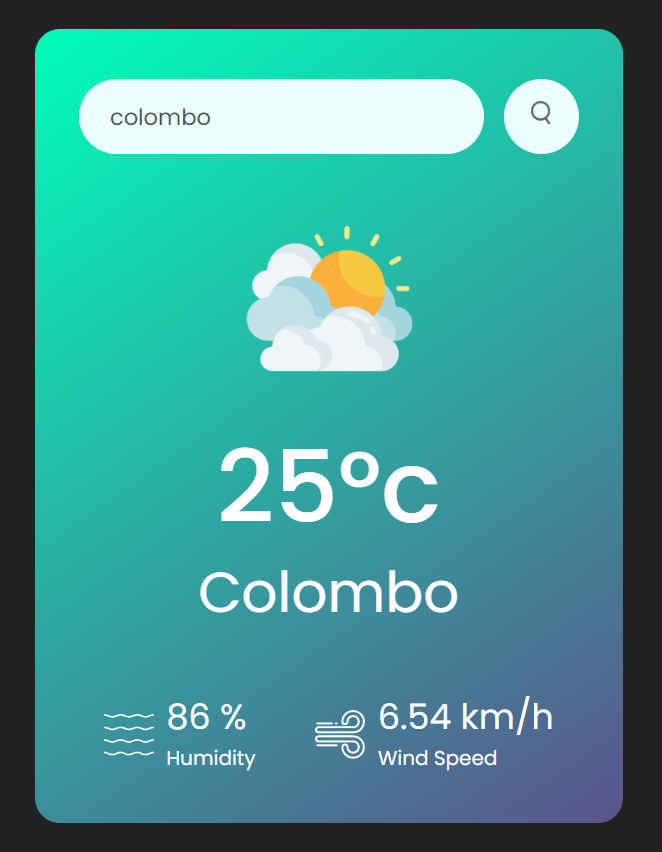

# Weather App

A responsive weather application that displays the current weather conditions for a specified city.

## Technologies

- **HTML**: Structure of the application.
- **CSS**: Styling and layout of the application.
- **JavaScript**: Functionality and interactivity.
- **OpenWeather API**: Fetches real-time weather data.

## Features

- 🌡️ Display current temperature
- 🌧️ Show weather conditions with icons
- 🌬️ Display wind speed
- 💧 Display humidity level
- 🔍 Search for any city to get weather updates
- 🚫 Error handling for invalid city names

## Setup

### Prerequisites

Ensure you have the following installed on your local machine:

- A web browser (Chrome, Firefox, etc.)
- Internet connection to fetch data from OpenWeather API

### Running the Application

1. **Clone the repository to your local machine:**
   ```sh
   git clone https://github.com/your-username/weather-app.git
   cd weather-app
   ```
2. **Open `weather-app.html` in your web browser.**

## Screenshots

<div align="center">
  
</div>

## Credits

- GreatStack (YouTube) : [How To Make Weather App Using JavaScript Step By Step Explained](https://www.youtube.com/watch?v=MIYQR-Ybrn4&list=PLjwm_8O3suyOgDS_Z8AWbbq3zpCmR-WE9)

